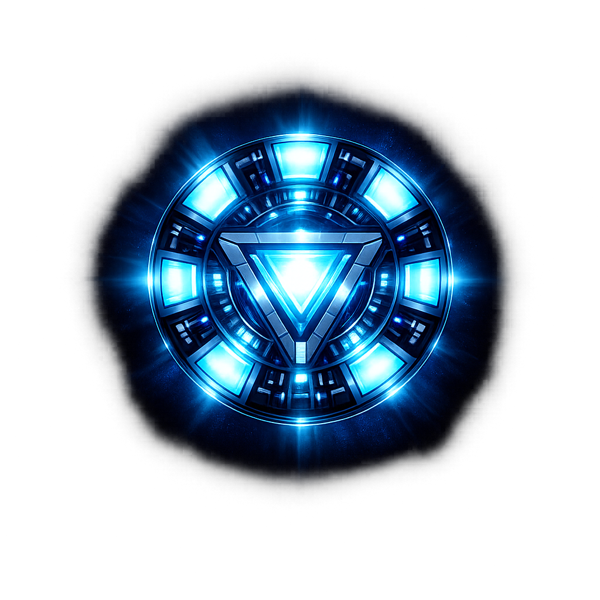

<!-- ARC REACTOR -->

# ❤️💛 IRON MAN 💛❤️

### ⚡ Powered by J.A.R.V.I.S. ⚡
**J**ust **A** **R**ather **V**ery **I**ntelligent **S**ystem
  

---

# ⚡ About This Project

> A **testing website** built in the **Iron Man Theme** ❤️💛 inspired by futuristic UI, Tony Stark technology, and J.A.R.V.I.S aesthetics.

> This repository is 

---

# 🚀 How to Deploy the Webpage in Vercel

## VERCEL
> One of the way to Deploy the Webpage is through the Vercel Website.

> In this repo we are deploying the webpage using Vercel.

> I have already created a Project

> Go into **Vercel Project `ironman_wp`** to view all the files.

---
# 🌍 Links

 Vercel Website Link

I have another Repo in which the website is deployed using GitHub Actions

---

# 👨‍💻 Author

## Venkat Nishit Kureti

> ⚡ “Sometimes you gotta run before you can walk.” — Tony Stark

---

